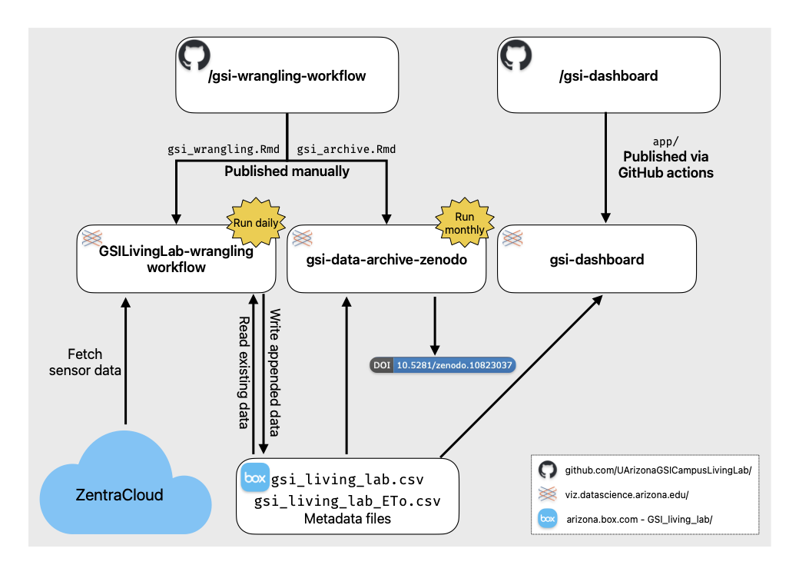

# gsi-wrangling-workflow

[](https://www.repostatus.org/#active)

This repository contains code to automatically collect and wrangle data from the [GSI Living Lab](https://udallcenter.arizona.edu/news/campus-living-lab-creating-more-sustainable-campus-designing-building-and-monitoring-green) at University of Arizona.
The data set is available upon request.
Request data here: [GSI Living Lab Data Request](https://forms.gle/63qWCybhvHaHunuH6).

## How does it work?



This repository houses `gsi_wrangling.Rmd` which is published to Posit Connect as a scheduled workflow running daily at noon.
This .Rmd file contains code to pull the most recent data for the Campus Living Lab sites from [ZentraCloud](https://zentracloud.com/), wrangle the data, and append it to a .csv file stored on Box.
The [gsi-dashboard repository](https://github.com/UArizonaGSICampusLivingLab/gsi-dashboard) contains code for a [Shiny](https://shiny.posit.co/) app that is automatically deployed to Posit Connect (using GitHub Actions) when updates are made to the main branch.
This Shiny app reads in the data from Box on start-up and provides interactive visualizations of the data.

### Contributing

To run the code in this repo locally, you'll need to set up access to Zentra Cloud and access to the Box API

#### `renv`

This project uses [`renv`](https://rstudio.github.io/renv/) for package management.
When you open this R Project, `renv` will bootstrap itself and should prompt you to run `renv::restore()` to install all dependencies.
If for some reason `renv::restore()` doesn't work for you, you can deactivate `renv` with `renv::deactivate()` and install packages the usual way.
`renv` is primarily used in this project for publishing to Posit Connect, and shouldn't be necessary for you to run any of the code locally.

#### Zentra Cloud

1.  Create a .Renviron file (e.g. with `usethis::edit_r_environ("project")`) and add an environment variable for the Zentra Cloud API token

```         
ZENTRACLOUD_TOKEN=<token>
```

2.  If for some reason `renv::restore()` didn't install the `zentracloud` R package, you can install it from r-universe or directly from GitLab

``` r
# r-universe installation
install.packages('zentracloud', repos = c('https://cct-datascience.r-universe.dev', 'https://cloud.r-project.org'))

# GitLab installation
pak::pkg_install("gitlab::meter-group-inc/pubpackages/zentracloud")
```

3.  The token in .Renviron is not automatically read in by `zentracloud`, so you'll find code to set options at the top of most scripts:

``` r
zentracloud::setZentracloudOptions(
  token = Sys.getenv("ZENTRACLOUD_TOKEN"),
  domain = "default"
)
```

#### Box

The Box API is accessed using the `boxr` package.
You'll find instructions on how to authenticate with Box on the [`boxr` website](https://r-box.github.io/boxr/articles/boxr.html).

If you're a collaborator just interested in running this code locally, you can follow [these instructions](https://r-box.github.io/boxr/articles/boxr-app-interactive.html) to authenticate to Box as a user (this is called an "interactive app", which is a little confusing).
Once you've followed those instructions and have added a `BOX_CLIENT_ID` and `BOX_CLIENT_SECRET` to the `.Renviron` file, just be sure to replace `box_auth_service()` with `box_auth()` and you should be able to run the code in `gsi_wrangling.Rmd`.

This automated workflow uses a [service app](https://r-box.github.io/boxr/articles/boxr-app-service.html) to upload data to a shared box folder when `gsi_wrangling.Rmd` is run on Posit Connect.
If you need to change any settings or get credentials for this service app, you'll need to request access from Vanessa Buzzard or the CCT Data Science group.

`R/box_app_setup.R` contains some code used when setting up the Box service app authentication (think of it like notes rather than a script to run).
The only thing I've done differently from the `boxr` documentation is to copy the contents of the `.boxr-auth` file and added it as an environment variable `BOX_TOKEN_TEXT`.

#### Posit Connect

The automated workflow can be found in `gsi_wrangling.Rmd` and is published on University of Arizona's [Posit Connect server](https://datascience.arizona.edu/analytics-powerhouse/rstudio-connect) where it runs daily as a scheduled report.

To publish `gsi_wrangling.Rmd` to Posit Connect and have it work, you need to add secret [environment variables](https://docs.posit.co/connect/user/content-settings/#content-vars) for `ZENTRACLOUD_TOKEN` and `BOX_TOKEN_TEXT`.

### Files

in `R/` you will find:

-   `box_app_setup.R`: some code I used when first setting up Box authentication. Not to be run again, but just as an example.
-   `estimate_data_size.R`: a script for extrapolating data size
-   `gsi_get_data.R`: a function, `gsi_get_data()`, for downloading and wrangling data from the Zentra Cloud API.
-   `gsi_get_eto.R`: a function, `gsi_get_eto()`, for downloading potential evapotranspiration data from the ZentraCloud models API endpoint.
-   Other functions used to calculate variables such as heat index, wind chill, etc.

### Contributors

<!-- eventually add CITATION.cff -->

-   Eric Scott
-   Malcolm Barrios
-   Kristina Riemer
-   Vanessa Buzzard
