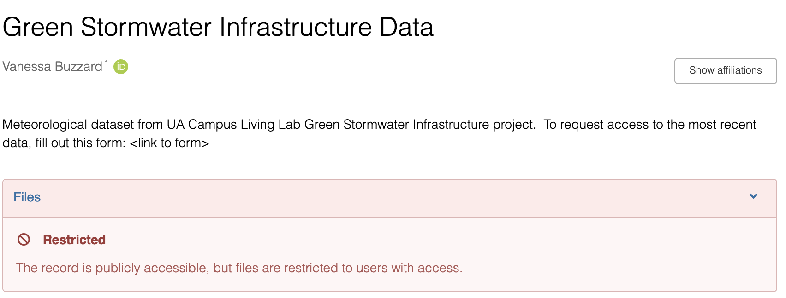
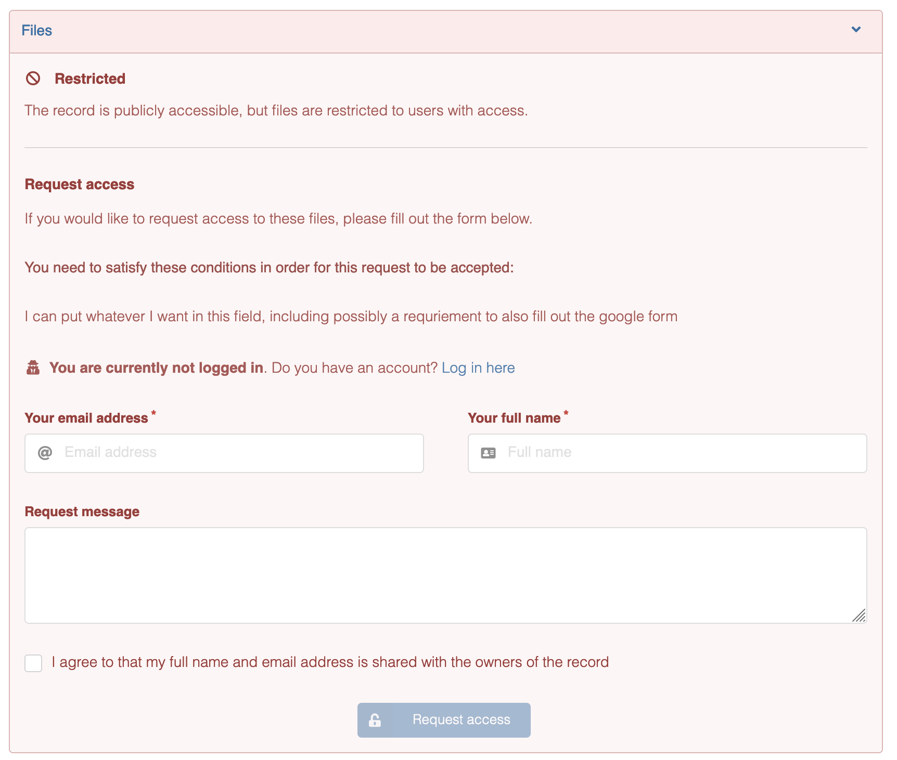

## Load Packages

```{r setup}
library(boxr)
library(httr2)
library(purrr)
library(fs)
library(glue)

box_auth_service(token_text = Sys.getenv("BOX_TOKEN_TEXT"))

## Set base URL for API requests
req_base <- 
  request("https://sandbox.zenodo.org/api/") |>
  req_url_path_append("deposit", "depositions") |> 
  req_auth_bearer_token(token = Sys.getenv("ZENODO_TOKEN"))
```

## Initial Release

Although we *can* create a new record via the Zenodo API, I think it will be easiest if the first deposit is created "manually" via upload to zenodo.org.
Once there is a record ID, this script will get current contents of the Box folder, create a .zip file, and upload a new version to the record on Zenodo.

There are two options for allowing access to a restricted dataset, I think.

-   No access form on Zenodo itself. This is the default, and you'll have to include in the description field a link to the google form. Then you can create unique links from Zenodo to send to individuals requesting access

    

-   Enable access request form on Zenodo itself. People who find the Zenodo record will encounter a form, optionally with a custom message about access conditions. You can then manage requests in the Zenodo dashboard (I assume you'll get an email about them as well) and accepted request automatically get sent a unique link to access the record.

    

Either way, take care of the following when uploading the initial deposit:

-   Set the version as 1.0.0.
    We'll use "semantic versioning" and have the automated workflow only increment the last number.
    "Major" and "minor" versions will be reserved for manual releases (.e.g. when we fix a mistake in the data or when a new column is added).

-   List Kristina and Eric in the "Contributors" section with the role "data manager" or maybe "data curator"?

-   In the "Related Works" section, enter the DOI for this repo with the relation "is compiled by" and Resource Type of "software"

Once you've created the record, we'll use the resulting concept record ID, which is the numbers at the end of the DOI **that points to all versions**

```{r}
concept_id <- 33102 #test on the sandbox api
```

## New Release

First, a new version gets created, then the data is attached to that version, then it is published.

### Create record for new version

Get latest version of record

```{r}
req_concept <- 
  req_base |> 
  req_url_path("api", "deposit", "depositions") |>
  req_url_query(
    sort = "mostrecent",
    all_versions = 1,
    q = '"query":"Green Stormwater Infrastructure Data","default_field":"title"'
    # q = glue::glue('"query":"{concept_id}","default_field":"conceptrecid"')
  )

resp_concept <-
  req_concept |> 
  req_perform()

concept <- resp_concept |> resp_body_json()

#TODO check here that there is only one result
prev_id <- concept[[1]][["record_id"]]
prev_version <- concept[[1]][["metadata"]][["version"]]
```


Create the new (unpublished) version

```{r}
req_post <- 
  req_base |> 
  req_url_path_append(prev_id, "actions", "newversion") |> 
  req_method("POST")
req_post

resp_new_ver <-
  req_post |> 
  req_perform()
```

Get the URL for the bucket to upload data to.

```{r}
new_ver <- 
  resp_new_ver |> 
  resp_body_json()
bucket_url <- new_ver$links$bucket
new_id <- new_ver$id
```

Extract metadata from previous release, modify, and attach modified version to new upload

```{r}
metadata <- 
  new_ver$metadat |> 
  list_modify(
    #Probably not best practice to use unexported functions from packages, but didn't feel like writing my own function to do this
    version = usethis:::bump_version(prev_version)["patch"] |> unname(),
    publication_date = Sys.Date()
  )

```

```{r}
req_new_meta <-
  req_base |> 
  req_method("PUT") |> 
  req_url_path_append(new_id) |> 
  req_body_json(data = list(metadata = metadata))
req_perform(req_new_meta)
```


### Attach data

Download most recent data from Box and create a .zip file for upload

```{r box-dl}
dir_id <- "250527085917"
box_setwd(dir_id)
#list current files
files <- box_ls() |> as.data.frame()

#download to tempdir
dir <- fs::path_temp()
dir_create(dir)
withr::defer(dir_delete(dir)) #deletes the tempdir when this script finishes I think

walk(files$id, \(x) box_dl(x, local_dir = dir, overwrite = TRUE))
#zip the whole dir
zip_path <- path(dir, "gsi_data.zip")
zip(zip_path, files = dir_ls(dir))
```

Use new Zenodo API to upload file directly to bucket link

```{r}
req_put <- request(bucket_url) |> 
  req_url_path_append(path_file(zip_path)) |> 
  req_auth_bearer_token(token = Sys.getenv("ZENODO_TOKEN")) |> 
  req_method("PUT") |> 
  req_body_file(zip_path)

req_put

resp_put <- 
  req_put |>
  req_perform()
```


### Publish

Attach metadata and publish

```{r}
req_publish <-
  req_base |> 
  req_url_path_append(new_id, "actions", "publish") |> 
  req_method("POST")
req_publish
resp_publish <- req_publish |> req_perform()
resp_publish
```
